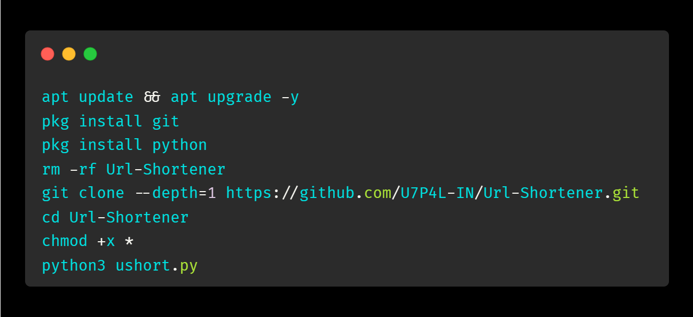
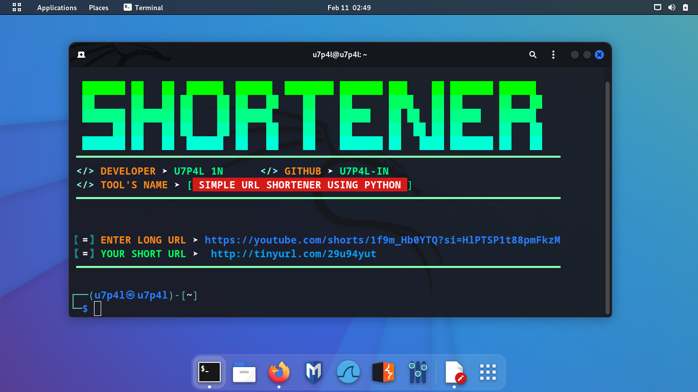
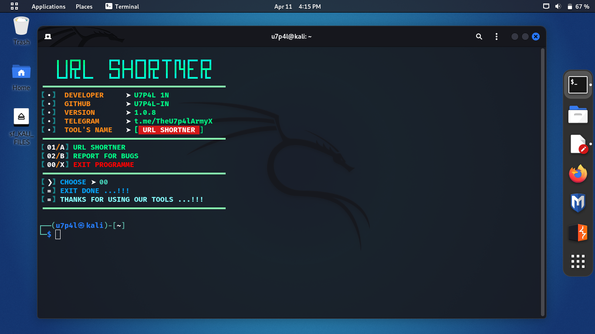
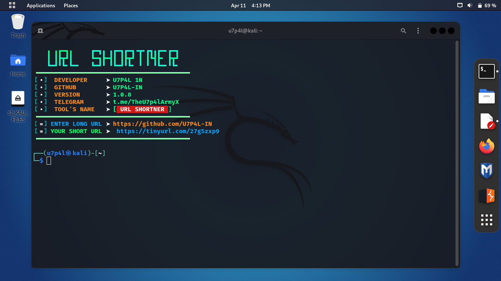

<h2 align="center">URL SHORTENER</h2>

  <div align="center"><a href="https://github.com/U7P4L-IN/Url-Shortener/stargazers/"></a><a href="https://github.com/U7P4L-IN/Url-Shortener/network/members/"></a><a href="https://github.com/U7P4L-IN/Url-Shortener/issues"></div>
  <div align="center"></a><a href="https://github.com/U7P4L-IN/Url-Shortener/pull"></a><a href="https://github.com/U7P4L-IN/Url-Shortener/archive/refs/heads/master.zip"></a></div></br>

## Language</br>

 <p align="center">
 
> [!INFORMATION]
> 
> A URL shortener is a tool that takes a long and unwieldy URL (Uniform Resource Locator) and converts it into a shorter, more concise version. The shortened URL redirects to the original, longer URL when accessed

### Tested On :

* Kali Linux

* Kali Nethunter

* Termux ( Rooted/NonRooted Devices)

## Contributing
Feel Free To Clone This Project. For Major Changes, Please Open An Issue First To Discuss What You Would Like To Change Or Add, Thank You!!.

## Requirements 
```
python-3
pip
Internet Connection
And some other python packages
``` 
### Install Requirements (on Linux/Termux)

```python
>> pip install pyshorteners
```
<h3 align="center"><b>TERMINAL INSTALLATION</b></h3>

### TERMUX INSTALLATION >
```python
apt update && apt upgrade -y
pkg install git
pkg install python
rm -rf Url-Shortener
git clone --depth=1 https://github.com/U7P4L-IN/Url-Shortener.git
cd Url-Shortener
chmod +x *
python3 ushort.py
```
<p align="center">

<h5 align="center"><b>TERMUX > </b></h5>

<p align="center">
<p align="center">

### Kali Linux / Ubuntu / Parrot OS :
```python
sudo apt-get update && apt-get install git
git clone https://github.com/U7P4L-IN/Url-Shortener.git
cd Url-Shortener
ls
sudo python3 ushort.py
```

<h5 align="center"><b>KALI LINUX > </b></h5>
<p align="center">
<p align="center">


<h2 align="center">LICENSE</h2>

Url Shortener is released under the MIT license, which grants the following permissions:
- Commercial use
- Modification
- Distribution
- Patent use
- Private use

For more convoluted language, see the [LICENSE](/LICENSE).

# Report bugs
If you notice issues while installing this tool or running this tool kindly mail to me at <a href="mailto: lisame0007@gmail.com">Gmail</a> or Open an issue via github.


<br>
<h3 align="LEFT"><b>LANGUAGE > </b></h3>

<p align="center">

</p>

<h3 align="center"><b>DESCRIPTION</b></h3>

> [!NOTE]  
> All the tools are belongs to their copyright owner, and this use is in accordance with the terms and conditions of the copyright holder.

# Give A Star ⭐

> You can also give this repository a star to show more people and they can use this repository
